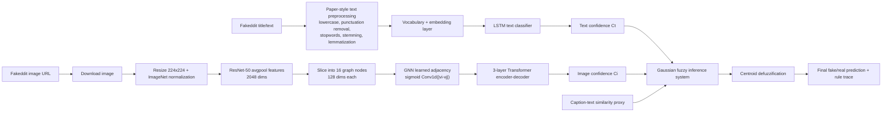

# Trustify-Style Architecture Used For Fakeddit

This implementation keeps the paper's architecture shape but evaluates it on a Fakeddit subset because the paper-linked TruthSeeker Kaggle dataset has no image files or captions.

## Dataset-Specific Notes

- Fakeddit `clean_title` is used as text input.
- Fakeddit `image_url` is downloaded into local JPEG files for ResNet-50.
- Fakeddit `clean_title` is also used as the decoder caption target because Fakeddit does not provide separate human image captions.
- Fakeddit observed binary convention is `2_way_label=1` for real/true-style posts and `0` for fake-style posts.
- This is a complete multimodal experiment, not an exact reproduction of the paper's claimed Twitter/BuzzFeed/PolitiFact experiments.

